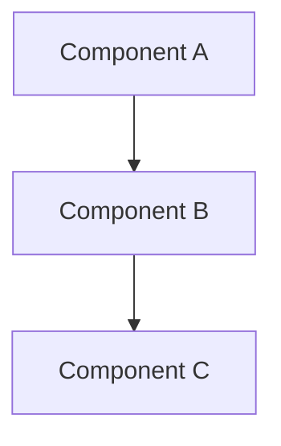

# PRD: [Project Name]

**Created**: [Date]
**Owner**: [Name]
**Status**: Draft | In Review | Approved

---

## Executive Summary

[1-2 paragraphs answering: What, Why, Who, When, Success]

[Project Name] is a [type of product/feature] designed to [solve problem] for [target users]. Currently, [users] struggle with [pain point], resulting in [negative outcome]. This solution will [key benefit], enabling [positive outcome].

Success will be measured by [metric 1], [metric 2], and [metric 3]. The MVP targets [timeline], with full release by [date].

---

## System Architecture

### High-Level Design

[Or provide detailed description if diagram not needed]

### Component Details

- **Component A**: [Description, technology]
- **Component B**: [Description, technology]
- **Component C**: [Description, technology]

---

## Feature Breakdown

### Must Have (MVP)

1. **Feature 1**
   - Description
   - User Value: [Why this matters to users]

2. **Feature 2**
   - Description
   - User Value: [Why this matters to users]

### Should Have (v1.1)

1. **Feature 3**
   - Description
   - User Value: [Enhancement to core experience]

### Could Have (Future)

1. **Feature 4**
   - Description
   - User Value: [Optional enhancement]

### Won't Have (Explicit Exclusions)

1. **Feature 5**
   - Reason: [Why explicitly excluded]

---

## Implementation Checklist

### Setup & Infrastructure
- [ ] Initialize project repository
- [ ] Set up development environment
- [ ] Configure CI/CD pipeline
- [ ] Provision cloud infrastructure (if applicable)

### Backend Development
- [ ] Design database schema
- [ ] Implement authentication service
- [ ] Build core API endpoints
- [ ] Add input validation and error handling
- [ ] Write API documentation

### Frontend Development
- [ ] Set up frontend framework
- [ ] Implement UI components
- [ ] Integrate with backend APIs
- [ ] Add responsive design
- [ ] Implement error handling and loading states

### Testing & QA
- [ ] Write unit tests (target coverage: 80%+)
- [ ] Write integration tests
- [ ] Write E2E tests
- [ ] Perform security testing
- [ ] Load testing (if applicable)

### Security & Compliance
- [ ] Implement authentication and authorization
- [ ] Add input sanitization (prevent XSS, SQL injection)
- [ ] Configure HTTPS/TLS
- [ ] Review CMMC compliance (if applicable)
- [ ] Add audit logging

### Documentation
- [ ] Write API documentation
- [ ] Create user guide
- [ ] Document deployment process
- [ ] Update README
- [ ] Architecture decision records (ADRs)

### Deployment
- [ ] Deploy to staging environment
- [ ] Perform UAT (user acceptance testing)
- [ ] Deploy to production
- [ ] Monitor and log errors
- [ ] Set up alerting

---

## Technical Specifications

### Tech Stack
- **Frontend**: [Framework, libraries, version]
- **Backend**: [Language, framework, version]
- **Database**: [Type, version]
- **Infrastructure**: [Cloud provider, services]
- **CI/CD**: [Platform, tools]

### Data Models

[Key entities and relationships]

### API Design (Optional)

[Key endpoints, request/response formats]

---

## Success Metrics & Timeline

### Success Metrics

- **User Adoption**: [X users in Y weeks]
- **Feature Usage**: [Z% of users engage with feature]
- **Performance**: [Page load <Xs, API response <Yms]
- **Business Goals**: [Revenue, retention, engagement targets]

### Timeline & Milestones

| Milestone | Deliverable | Target Date | Owner |
|-----------|-------------|-------------|-------|
| PRD Complete | This document | [Date] | [Name] |
| Design Complete | Architecture + mockups | [Date] | [Name] |
| MVP Development | Core features working | [Date] | [Name] |
| Testing Complete | All tests pass | [Date] | [Name] |
| Production Launch | Live to users | [Date] | [Name] |

---

## Risks & Mitigation

| Risk | Impact | Probability | Mitigation |
|------|--------|-------------|------------|
| [Risk 1] | High/Med/Low | High/Med/Low | [How to mitigate] |
| [Risk 2] | High/Med/Low | High/Med/Low | [How to mitigate] |

---

## Open Questions

- [ ] Question 1
- [ ] Question 2

---

## Appendix

### User Personas

**Persona 1: [Name]**
- Role: [Job title]
- Goals: [What they want to achieve]
- Pain Points: [Current frustrations]
- Needs: [What this product must provide]

### References

- [Link to research]
- [Link to competitor analysis]
- [Link to design mockups]

---

**PRD Version**: 1.0
**Last Updated**: [Date]
