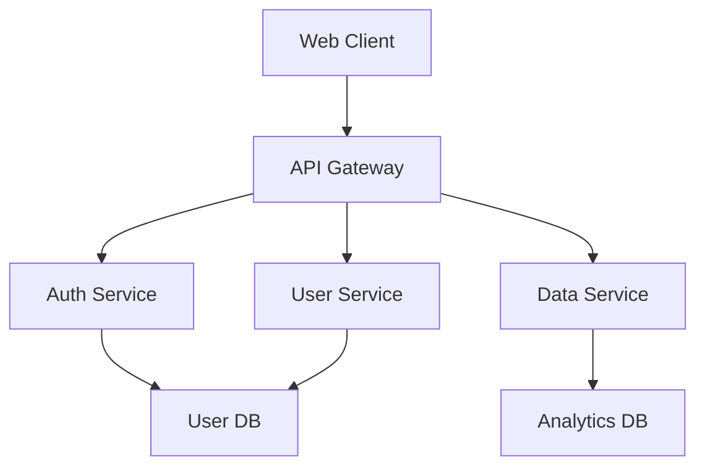

# CreatePrd Workflow

Create comprehensive Product Requirements Document (PRD) with executive summary, architecture, feature breakdown, and implementation checklist.

## When to Use

- Starting a new project or major feature
- Need structured requirements before coding
- Want to align team on scope and architecture
- Seeking clarity on business value and technical approach

## Inputs

**Required**:
- Project/feature idea (what you want to build)

**Optional but helpful**:
- User problems or pain points
- Business goals or constraints
- Technical constraints (budget, timeline, tech stack)
- Existing documentation or research

## Workflow Steps

### Step 1: Understand Business Context

Ask clarifying questions to uncover the WHY:

**Questions to Ask**:
1. **Business Value**: What problem does this solve? Who benefits?
2. **Success Metrics**: How will we measure success?
3. **Users**: Who are the primary users? What do they need?
4. **Constraints**: Budget? Timeline? Technical limitations?
5. **Scope**: MVP vs. full-featured? What's essential vs. nice-to-have?

**Output**: Clear understanding of business goals and user needs

---

### Step 2: Define Executive Summary

Write 1-2 paragraph summary answering:
- **What**: What are we building?
- **Why**: Why are we building it? (business value)
- **Who**: Who is it for? (user personas)
- **When**: What's the timeline/milestone?
- **Success**: How do we know it's successful?

**Template**:
```markdown
## Executive Summary

[Project Name] is a [type of product/feature] designed to [solve problem] for [target users]. Currently, [users] struggle with [pain point], resulting in [negative outcome]. This solution will [key benefit], enabling [positive outcome].

Success will be measured by [metric 1], [metric 2], and [metric 3]. The MVP targets [timeline], with full release by [date].
```

---

### Step 3: Design System Architecture

Create high-level system architecture:

**Components to Define**:
1. **Frontend**: Technology, structure, key pages/views
2. **Backend**: API design, services, data flow
3. **Database**: Schema design, data models
4. **Infrastructure**: Hosting, deployment, scaling
5. **Integration**: External APIs, third-party services
6. **Security**: Authentication, authorization, data protection

**Output Format**: Mermaid diagram or detailed description

**Example**:
```markdown
## System Architecture

### High-Level Design


### Component Details
- **Web Client**: React SPA, responsive design
- **API Gateway**: Express.js REST API
- **Auth Service**: JWT-based authentication, OAuth2 support
- **User Service**: CRUD operations, profile management
- **Data Service**: Analytics data aggregation
- **User DB**: PostgreSQL for relational data
- **Analytics DB**: MongoDB for event tracking
```

---

### Step 4: Break Down Features

List all features, prioritized by user value:

**Prioritization Framework** (MoSCoW):
- **Must Have**: Critical for MVP, cannot launch without
- **Should Have**: Important but not critical, v1.1 candidate
- **Could Have**: Nice-to-have, future enhancement
- **Won't Have**: Out of scope, explicitly excluded

**Feature Template**:
```markdown
## Feature Breakdown

### Must Have (MVP)
1. **User Authentication**
   - Email/password login
   - Password reset flow
   - Session management
   - User Value: Cannot use app without account

2. **Core Feature 1**
   - Description
   - User Value: [Why this matters]

### Should Have (v1.1)
1. **Feature 3**
   - Description
   - User Value: Enhances core experience

### Could Have (Future)
1. **Feature 4**
   - Description
   - User Value: Optional enhancement

### Won't Have (Explicit Exclusions)
1. **Feature 5**
   - Reason: Out of scope for v1
```

---

### Step 5: Create Implementation Checklist

Break down implementation into actionable tasks:

**Categories**:
1. **Setup & Infrastructure**
2. **Backend Development**
3. **Frontend Development**
4. **Testing & QA**
5. **Security & Compliance**
6. **Documentation**
7. **Deployment**

**Checklist Template**:
```markdown
## Implementation Checklist

### Setup & Infrastructure
- [ ] Initialize project repository
- [ ] Set up development environment
- [ ] Configure CI/CD pipeline
- [ ] Provision cloud infrastructure (if applicable)

### Backend Development
- [ ] Design database schema
- [ ] Implement authentication service
- [ ] Build core API endpoints
- [ ] Add input validation and error handling

### Frontend Development
- [ ] Set up frontend framework
- [ ] Implement UI components
- [ ] Integrate with backend APIs
- [ ] Add responsive design

### Testing & QA
- [ ] Write unit tests (target coverage: 80%+)
- [ ] Write integration tests
- [ ] Write E2E tests (see TestArchitect skill)
- [ ] Perform security testing (see Security skill)

### Security & Compliance
- [ ] Implement authentication and authorization
- [ ] Add input sanitization (prevent XSS, SQL injection)
- [ ] Configure HTTPS/TLS
- [ ] Review CMMC compliance (if applicable)

### Documentation
- [ ] Write API documentation
- [ ] Create user guide
- [ ] Document deployment process
- [ ] Update README

### Deployment
- [ ] Deploy to staging environment
- [ ] Perform UAT (user acceptance testing)
- [ ] Deploy to production
- [ ] Monitor and log errors
```

---

### Step 6: Add Technical Specifications

Include technical details for developers:

**Tech Stack**:
- Frontend: [Framework, libraries]
- Backend: [Language, framework]
- Database: [Type, version]
- Infrastructure: [Cloud provider, services]

**Data Models**: Key entities and relationships

**API Design**: Endpoints, request/response formats (optional but helpful)

---

### Step 7: Define Success Metrics & Timeline

**Success Metrics**:
- User adoption (X users in Y weeks)
- Feature usage (Z% of users engage with feature)
- Performance (page load <2s, API response <500ms)
- Business goals (revenue, retention, engagement)

**Timeline**:
```markdown
## Timeline & Milestones

| Milestone | Deliverable | Target Date |
|-----------|-------------|-------------|
| PRD Complete | This document | Week 1 |
| Design Complete | Architecture + mockups | Week 2 |
| MVP Development | Core features working | Week 6 |
| Testing Complete | All tests pass | Week 7 |
| Production Launch | Live to users | Week 8 |
```

---

### Step 8: Generate project-context.md

Create the "bible" document for the project:

**project-context.md includes**:
- Executive summary (from Step 2)
- System architecture (from Step 3)
- Tech stack decisions
- User personas
- Success metrics
- Timeline

This file is referenced by all agents during standup discussions.

---

## Output Files

After completing this workflow, you will have:

1. **PRD.md** - Complete product requirements document
2. **project-context.md** - Project "bible" for team alignment
3. **architecture-diagram.mmd** (optional) - Mermaid architecture diagram

---

## Quality Checklist

Before marking PRD as complete, verify:

- [ ] Executive summary is clear and concise (1-2 paragraphs)
- [ ] Business value is articulated (WHY we're building this)
- [ ] System architecture is defined (high-level components)
- [ ] Features are prioritized (Must/Should/Could/Won't)
- [ ] Implementation checklist is actionable
- [ ] Success metrics are measurable
- [ ] Timeline is realistic (based on team velocity if known)
- [ ] Technical specifications are sufficient for developers

**Validation Gate** (Week 2 of MVP):
- PRD scores ≥8/10 on quality rubric (see knowledge/prd-rubric.md)
- Peer review by senior developer confirms clarity

---

## Example PRD Structure

```markdown
# PRD: User Authentication System

## Executive Summary
A secure authentication system enabling users to create accounts, log in, and manage their profiles. Currently, the application has no user accounts, preventing personalization and data persistence. This solution will enable user-specific features, data security, and compliance with privacy regulations.

Success: 80% of users create accounts within first week, <5% auth-related support tickets, zero security breaches.

## System Architecture
[Diagram or description]

## Feature Breakdown
### Must Have (MVP)
1. Email/password registration
2. Login with session management
3. Password reset via email
4. Basic profile management

### Should Have (v1.1)
5. OAuth2 (Google, GitHub)
6. Two-factor authentication
7. Email verification

## Implementation Checklist
[Full checklist from Step 5]

## Technical Specifications
- Backend: Node.js + Express
- Database: PostgreSQL
- Auth: JWT tokens, bcrypt for passwords
- Email: SendGrid API

## Success Metrics
- User adoption: 500 accounts in 30 days
- Auth performance: Login <500ms
- Security: Zero credential leaks

## Timeline
MVP: 4 weeks from kickoff
```

---

## Integration with Other Skills

**After CreatePrd**:
1. Use **CreateEpics** to break PRD into user-value themes
2. Use **Security → ThreatModel** to identify security risks
3. Use **TestArchitect → RiskBasedTesting** to plan test strategy

**During Standup**:
- PM agent challenges business value
- Architect reviews technical feasibility
- Security checks CMMC compliance

---

## Tips for Great PRDs

**DO**:
✅ Start with user problems, not solutions
✅ Keep executive summary to 1-2 paragraphs
✅ Prioritize ruthlessly (MVP vs. nice-to-have)
✅ Include measurable success metrics
✅ Make implementation checklist actionable

**DON'T**:
❌ Write "requirements" that are solutions in disguise
❌ Skip the WHY (business value)
❌ Include every feature ever imagined (scope creep)
❌ Use vague success metrics ("users will love it")
❌ Commit to timelines without velocity data

---

## Estimated Time

**First PRD**: 30-45 minutes (learning the workflow)
**Subsequent PRDs**: 10-15 minutes (workflow becomes familiar)
**Complex projects**: 20-30 minutes (more features, architecture)

**Goal** (from MVP validation): <5 minutes for comprehensive PRD once practiced

---

**CreatePrd workflow complete. Proceed to CreateEpics to break PRD into deliverable chunks.**
