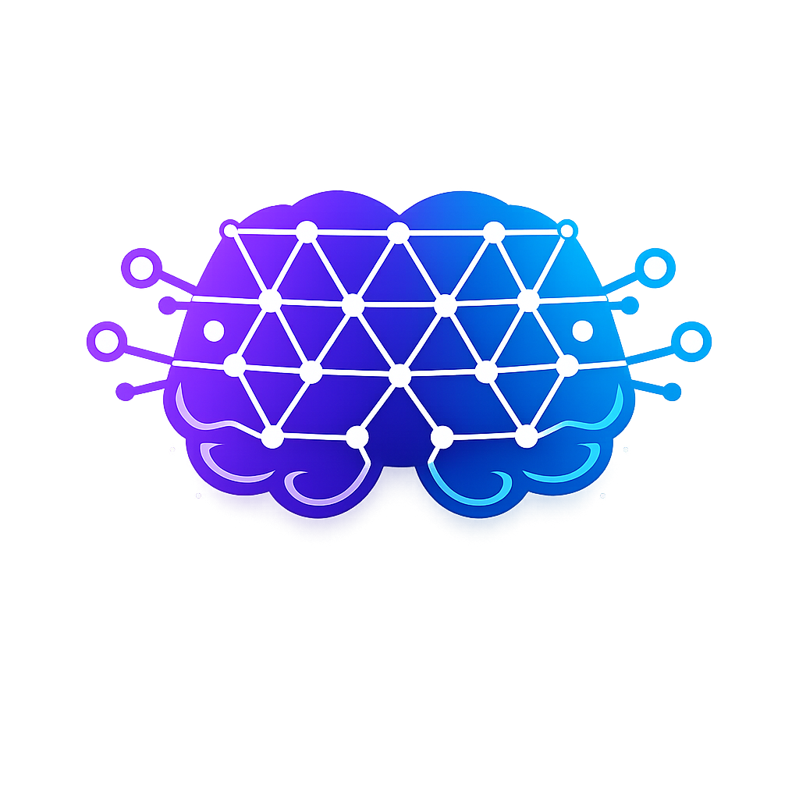
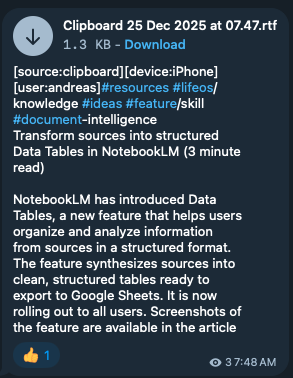
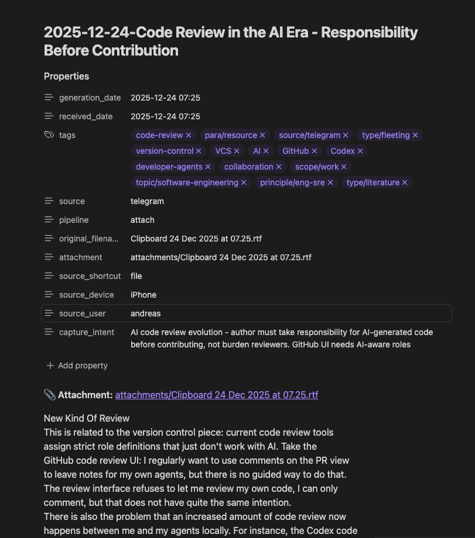

<p align="center">
  
</p>

# PAI Knowledge Bundle

> **FOR AI AGENTS:** You are about to install the PAI Knowledge bundle. Walk your principal through an interactive wizard to configure their system, then create the necessary files. Do NOT run install.ts—that's for humans in terminals. YOU are the wizard.

> You stay focused. The system handles the noise.

---

## AI Installation Wizard

The wizard has four phases:
1. **Phase 1: System Setup** - Where to install, vault location
2. **Phase 2: Telegram Setup** - Create bots and channels
3. **Phase 3: Processing Configuration** - API keys and profile
4. **Phase 4: Create Files** - Write all configuration files

---

### Phase 1: System Setup

**Ask these questions first:**

1. **Where is your PAI directory?** (default: `~/.claude`)
2. **What is the path to your Obsidian vault?** (e.g., `~/Documents/Brain`, `~/Obsidian/Knowledge`)

**Validate:**
```bash
# Check PAI directory exists
ls -la $PAI_DIR

# Check vault exists
ls -la "[vault path]"
```

---

### Phase 2: Telegram Setup

**This bundle uses TWO Telegram bots** - one for sending captures, one for reading/processing.

#### Step 2.1: Create the Sender Bot

> "Open Telegram and message @BotFather. Create a new bot for SENDING captures from your devices."

Guide them through:
1. Message @BotFather → `/newbot`
2. Name: `[Their Name] PAI Sender` (e.g., "John PAI Sender")
3. Username: `[unique]_pai_sender_bot` (e.g., `john_pai_sender_bot`)
4. Copy the API token

**Ask:** "What is your sender bot token?"

#### Step 2.2: Create the Reader Bot

> "Create a second bot for READING and processing messages."

1. Message @BotFather → `/newbot`
2. Name: `[Their Name] PAI Reader`
3. Username: `[unique]_pai_reader_bot`
4. Copy the API token

**Ask:** "What is your reader bot token?"

#### Step 2.3: Create the Inbox Channel

> "Create a private Telegram channel for raw captures (your inbox)."

1. Telegram → New Channel → "PAI Inbox"
2. Make it **Private**
3. Add BOTH bots as administrators (with post messages permission)
4. Get channel ID: Forward any message to @userinfobot, copy the Chat ID

**Ask:** "What is your inbox channel ID?" (should start with -100)

#### Step 2.4: Create the Events Channel (Optional)

> "Optionally create a second channel for processed notifications."

If they want notifications:
1. Create "PAI Events" private channel
2. Add the **reader bot only** as admin (sender doesn't need access here)
3. Get channel ID from @userinfobot

**Ask:** "What is your events channel ID?" (or skip)

---

### Phase 3: Processing Configuration

**Ask these questions:**

1. **Do you have an OpenAI API key?** (Required for embeddings and vision)
   - If not: "Get one at https://platform.openai.com/api-keys"

2. **Which processing profile?**
   - `zettelkasten` (default) - Full PARA/Zettelkasten tagging, sophisticated classification
   - `simple` - Basic tagging, minimal classification

**Record all answers for Phase 4.**

---

### Phase 4: Create Files

**After gathering all answers, create these files:**

#### 4.1: Environment Configuration

Write to `$PAI_DIR/.env` (append to existing or create):

```bash
# PAI Knowledge Capture Configuration
# Generated by AI Installation Wizard

# Telegram Bots
TELEGRAM_SENDER_BOT_TOKEN=[sender token from Phase 2.1]
TELEGRAM_BOT_TOKEN=[reader token from Phase 2.2]

# Telegram Channels
TELEGRAM_CHANNEL_ID=[inbox channel ID from Phase 2.3]
TELEGRAM_OUTBOX_ID=[events channel ID from Phase 2.4, or same as inbox]

# Obsidian Vault
OBSIDIAN_VAULT_PATH=[vault path from Phase 1]

# Processing Profile
INGEST_PROFILE=[zettelkasten or simple]

# OpenAI (for embeddings and vision)
OPENAI_API_KEY=[their OpenAI key]
```

#### 4.2: Context Skill Files

**Read `skill-pack.md` in this bundle directory** and extract all embedded files.

The skill-pack.md contains files marked with "Copy to:" patterns. Extract each one:

```
skill-pack.md contains:
├── SKILL.md                     → $PAI_DIR/skills/Context/SKILL.md
├── workflows/semantic-search.md → $PAI_DIR/skills/Context/workflows/semantic-search.md
└── workflows/sweep.md           → $PAI_DIR/skills/Context/workflows/sweep.md
```

**Steps:**
1. Read `Bundles/pai-knowledge/skill-pack.md`
2. Find each code block preceded by "Copy to: `path`"
3. Create the directory structure: `mkdir -p $PAI_DIR/skills/Context/workflows`
4. Write each file to its target location

#### 4.3: LaunchAgent (macOS only)

Write to `~/Library/LaunchAgents/com.pai.ingest-watch.plist`:

```xml
<?xml version="1.0" encoding="UTF-8"?>
<!DOCTYPE plist PUBLIC "-//Apple//DTD PLIST 1.0//EN" "http://www.apple.com/DTDs/PropertyList-1.0.dtd">
<plist version="1.0">
<dict>
    <key>Label</key>
    <string>com.pai.ingest-watch</string>
    <key>ProgramArguments</key>
    <array>
        <string>[path to bun]</string>
        <string>run</string>
        <string>[PAI repo]/bin/ingest/ingest.ts</string>
        <string>watch</string>
    </array>
    <key>EnvironmentVariables</key>
    <dict>
        <key>PAI_DIR</key>
        <string>[PAI_DIR value]</string>
    </dict>
    <key>RunAtLoad</key>
    <true/>
    <key>KeepAlive</key>
    <true/>
    <key>StandardOutPath</key>
    <string>/tmp/ingest-watch.log</string>
    <key>StandardErrorPath</key>
    <string>/tmp/ingest-watch.log</string>
</dict>
</plist>
```

Then load it:
```bash
launchctl load ~/Library/LaunchAgents/com.pai.ingest-watch.plist
```

#### 4.4: Build Embeddings

```bash
ctx embed --verbose
```

---

### Phase 5: Verification

Run these checks:

```bash
# Test Telegram connection
ingest poll

# Check daemon is running
launchctl list | grep pai.ingest

# Verify embeddings
ctx embed --stats
```

**Success criteria:**
- `ingest poll` connects to Telegram
- Daemon shows in launchctl output
- Embeddings show note count

---

## Human Installation (Alternative)

**For humans running directly in a terminal**, use the interactive wizard:

```bash
cd Bundles/pai-knowledge
bun run install.ts
```

This provides a guided terminal experience with validation and pretty output.

---

## About This Bundle

### The Problem

Ideas captured but lost. Conversations forgotten. Learning that fades.

AI is the most powerful thinking tool we've ever had—but it knows nothing about you. Every conversation starts cold. You explain your project. Set the context. Get it up to speed. Session ends, it all disappears. Next time? Start over.

Meanwhile, your knowledge is scattered across apps, folders, and bookmarks you'll never find again.

**The problem isn't AI capability. It's that AI can't access what you know.**

### The Vision

When AI knows your context, it supercharges you.

Imagine:
- Starting every AI conversation with relevant context already loaded
- Capturing thoughts in 3 seconds from any device
- Finding not just what you saved, but what's *relevant* right now
- Building on your past thinking rather than starting from scratch

---

## Why This Is Different

Most note-taking tools optimize for capture but fail at retrieval. This bundle treats knowledge as a living system—captured effortlessly, stored semantically, and cultivated intentionally. The AI doesn't just file your notes; it understands them, surfaces connections, and loads relevant context before you even ask.

- **Telegram as universal inbox eliminates friction from capture**
- **Semantic search finds meaning not just matching keywords**
- **Daily sweep practice turns fleeting thoughts into permanent**
- **Two-phase retrieval keeps you in control of context**

---

## What This Bundle Provides

This bundle implements the first two layers of the Knowledge Transformation Stack, plus cultivation practices that prepare your knowledge for connection:


| Layer | Tool | What It Does |
|-------|------|--------------|
| **CAPTURE** | `ingest` | Speak it, snap it, paste it—from any device. It just gets saved. |
| **STORE** | `ctx search/load` | Access your second brain. Retrieve and load the context relevant for what you're doing |
| **CULTIVATE** | `ctx sweep` | Review fleeting thoughts, tidy up, and prepare for connection—a tidy knowledge base enables linking |

**Everything lives in Obsidian**—plain markdown files you own forever. Browse with graph view, connect with wiki-links, sync across devices. The CLI tools work alongside Obsidian, not instead of it.

### Architecture

```
┌─────────────────────────────────────────────────────────────────────────────┐
│                           PAI KNOWLEDGE BUNDLE                               │
├─────────────────────────────────────────────────────────────────────────────┤
│                                                                              │
│  📱 DEVICES                    🤖 PROCESSING                 📚 STORAGE      │
│  ─────────                     ──────────                    ───────        │
│  iPhone      ─┐                                                             │
│  iPad         ├──► Telegram ──► ingest daemon ──► Obsidian Vault            │
│  Mac          │       │              │                  │                   │
│  CLI         ─┘       │              │                  │                   │
│                       │              ▼                  ▼                   │
│                       │         ┌─────────┐      ┌─────────────┐            │
│                       │         │ Whisper │      │ Embeddings  │            │
│                       │         │ Vision  │      │ (SQLite)    │            │
│                       │         │ Jina    │      └─────────────┘            │
│                       │         └─────────┘             │                   │
│                       │                                 ▼                   │
│                       │                          ┌─────────────┐            │
│                       └─────────────────────────►│ ctx CLI     │            │
│                                                  │ search/load │            │
│                                                  │ sweep       │◄──► Claude │
│                                                  └─────────────┘            │
│                                                                              │
└─────────────────────────────────────────────────────────────────────────────┘
```

### Bundle Dependencies

| Component | Dependency | Required | Purpose |
|-----------|------------|----------|---------|
| **CORE Skill** | `kai-core` | ✅ Yes | Reinforced skill routing - ensures Claude uses the right workflows |
| **Bun Runtime** | System | ✅ Yes | JavaScript runtime for CLIs |
| **OpenAI API** | External | ✅ Yes | Embeddings (text-embedding-3-small) and Vision |
| **Telegram** | External | ✅ Yes | Universal capture gateway |
| **Obsidian** | System | ✅ Yes | Knowledge storage (plain markdown) |
| **Jina AI** | External | Optional | URL content extraction |
| **Fabric** | External | Optional | Pattern-based content extraction |

### Installation Order

| Step | Component | Notes |
|------|-----------|-------|
| 1 | Kai (base) | Provides CORE skill routing |
| 2 | pai-knowledge bundle | This bundle |
| 3 | iOS/macOS Shortcuts | Optional mobile capture |

---

## Methodology: Tags Are the API

Knowledge scattered across folders is knowledge lost. Tags create a **13-dimension coordinate system** for your notes—enabling powerful queries, AI-assisted filing, and cross-cutting views.

### PARA (What To Do With It)

Tiago Forte's method organizes by actionability:

| Tag | Purpose |
|-----|---------|
| `para/project` | Has a deadline, finite |
| `para/area` | Ongoing responsibility |
| `para/resource` | Reference material |
| `para/archive` | Cold storage |

### Zettelkasten (How Mature Is It)

Note types track intellectual lifecycle:

```
┌──────────┐  sweep   ┌────────────┐  weave   ┌────────────┐  deep work  ┌─────────────┐
│ fleeting │ ───────▶ │ literature │ ───────▶ │  permanent │ ──────────▶ │ synthesized │
└──────────┘          │  reference │          └────────────┘             └─────────────┘
                      └────────────┘
```

- **Fleeting**: Raw capture, quick thought (24-48 hour lifespan)
- **Literature**: Summarized from external source
- **Permanent**: Your own atomic idea
- **Synthesized**: Amalgamated from multiple sources

### The 13 Dimensions

| Dimension | Purpose | Example |
|-----------|---------|---------|
| `para/*` | Actionability | `para/project` |
| `type/*` | Note maturity | `type/fleeting` |
| `format/*` | Content structure | `format/voice` |
| `source/*` | Origin | `source/telegram` |
| `scope/*` | Privacy boundary | `scope/work` |
| `status/*` | Workflow state | `status/inbox` |
| `topic/*` | Subject matter | `topic/ai` |
| `person/*` | People involved | `person/jane_doe` |
| `instance/*` | Project/area name | `instance/pai` |
| `session/*` | Cultivation session | `session/weave-2025-12-24` |
| `git/*` | Version control | `git/track` |
| `principle/*` | PAI principles | `principle/deterministic` |

**Why this matters:** A tidy knowledge base—where every note has clear coordinates—is the foundation for connection. You can't link what you can't find.

---

## The Single Front Door

**Telegram is the capture layer.** The device is just the interface.

- Voice memo on iPhone → Telegram → Whisper → Markdown
- Photo on Mac → Telegram → Vision → Markdown
- URL on iPad → Telegram → extraction → Markdown

CLI passes through the same front door.


### Multi-Modal Capture

| Input | Method | Processing |
|-------|--------|------------|
| 🎙️ **Voice** | Speak your thought | Whisper transcription |
| 📷 **Photo** | Snap a picture | Vision analysis, OCR |
| 📄 **Document** | Share a PDF/DOCX | Content extraction |
| 🔗 **URL** | Paste a link | Jina AI Reader |
| 🎬 **YouTube** | Share video link | Transcript extraction |
| 📝 **Text** | Type a note | Direct capture |

### Inline Commands

Type `/help` in Telegram to see all options:

**📝 TEXT** — Just send, auto-saves with AI tags

**🎤 VOICE** (m4a, mp3, wav, ogg) — Whisper transcription

**📄 DOCUMENTS** (pdf, docx, txt, md)
- `/attach` — Keep original filename (default)
- Caption = filename: `"Report #tag"` → Report.pdf

**📷 PHOTOS** (jpg, png, heic, webp)
- `/describe` — Vision AI description
- `/mermaid` — Diagram → code
- Default: save only (no OCR)

**🔗 URLS**
- `/fetch` — Raw content (no pattern)
- `/clean` — Strip HTML noise
- `/article` — Clean + extract wisdom

**📁 FILING** (any content type)
- `/file` — Rename TYPE-DATE-TITLE, sync to Dropbox
- `/name Title` — Set custom note/archive name
- `/date 2024-06-15` — Backdate (NLP: yesterday, last month, 15th June)
- `[type:CONTRACT]` `[category:WORK]` — Metadata

**🔮 FABRIC PATTERNS** (saves raw + pattern output)
- `/wisdom` `/summarize` `/article` `/meeting-notes`
- Any fabric pattern: `/[pattern-name]`

**🏷️ TAGS**
- PARA: `#project` `#area` `#resource` `#archive`
- Scope: `~private` `~work`
- Type: `#type/fleeting`
- People: `@name` → `#person/name`

**📊 STATUS** (note lifecycle)
- `#status/inbox` → `#status/cultivated` → `#status/archived`

**📦 LARGE FILES** (>20MB)
- `[file:name.pdf]` + iCloud Drop Buffer
- Requires: Terminal/Bun with **Full Disk Access** (System Preferences → Privacy & Security → Full Disk Access)

**Example capture (iOS clipboard shortcut):**
```
[source:clipboard][device:iPhone][user:john]
#resources #lifeos/knowledge #ideas #feature/skill

Transform sources into structured Data Tables in NotebookLM (3 minute read)

NotebookLM has introduced Data Tables, a new feature that helps users
organize and analyze information from sources in a structured format...
```

**Processed note in Obsidian:**

After processing, notes have structured frontmatter:

```yaml
---
generation_date: 2025-12-24 07:25
received_date: 2025-12-24 07:25
tags:
  - code-review
  - development
  - ai-coding-assistants
  - responsibility
source: telegram
url: https://example.com/article
summary: Author must take responsibility for AI-generated code
---

# Code Review in the AI Era - Responsibility Before Contribution

This is related to the version of code piece...
```

### iOS/macOS Shortcuts

<p>



</p>

| Method | What It Does |
|--------|--------------|
| **Clipboard Shortcut** | One tap → clipboard + metadata → Telegram |
| **iOS Share Panel** | Voice memos, photos, documents → Share → PAI |
| **macOS Quick Actions** | Right-click any file → ingest |

Add the shortcut to Control Center for one-tap capture. The bundle includes shortcut templates in `shortcuts/`.

---

## Cultivation: Sweep

Knowledge doesn't maintain itself. **Sweep** is a daily practice for processing raw captures—not just filing, but embedding knowledge into your own memory.

- Connect the dots between ideas
- Explain to yourself why you captured something
- Set priority and add context
- Archive or delete what doesn't matter

```bash
$ ctx sweep

🧹 SWEEP - Inbox Triage
────────────────────────────────────────────────────────────────────────────────
 #  │ Date       │ Type       │ Title                                    │ Tags
────────────────────────────────────────────────────────────────────────────────
 1  │ 2025-12-30 │ voice      │ AI Agent Architecture Ideas              │ topic/ai, stage/raw
 2  │ 2025-12-30 │ url        │ NotebookLM Data Tables Feature           │ topic/ai, source/telegram
 3  │ 2025-12-29 │ clipboard  │ Kubernetes CRD Patterns                  │ topic/devops
 4  │ 2025-12-29 │ text       │ Meeting notes from design review         │ project/pai

────────────────────────────────────────────────────────────────────────────────
Total: 4 inbox notes

Select: all | 1,3 | none
```

Select `all` to review each note as a flashcard:

```
━━━━━━━━━━━━━━━━━━━━━━━━━━━━━━━━━━━━━━━━━━━━━━━━━━━━━
📥 Note 1 of 4
━━━━━━━━━━━━━━━━━━━━━━━━━━━━━━━━━━━━━━━━━━━━━━━━━━━━━

📛 NAME
   Current:   2025-12-30-Document-Telegram-Raw-123
   Suggested: AI Agent Architecture Ideas

📁 CLASSIFICATION
   PARA:  para/resource
   Scope: work

🏷️ TAGS
   On note:   ideas, topic/ai
   Suggested: +type/idea, +format/article

📰 SOURCE: Voice memo
   🔗 Transcribed via Whisper

━━━━━━━━━━━━━━━━━━━━━━━━━━━━━━━━━━━━━━━━━━━━━━━━━━━━━
📝 SUMMARY: Ideas about multi-agent orchestration patterns
   and delegation strategies for AI systems...
━━━━━━━━━━━━━━━━━━━━━━━━━━━━━━━━━━━━━━━━━━━━━━━━━━━━━

Actions: done | priority high | rename | extract | skip | archive | delete | quit
```

Quick decisions: `done` accepts, `rename` improves the title, `extract` runs Fabric patterns, `archive` files it away, `delete` removes it.

### Cultivation Horizons

Sweep is the runway—clearing the deck daily. Higher practices operate at different altitudes:


| Horizon | Practice | What It Does | Status |
|---------|----------|--------------|--------|
| Runway | 🧹 **Sweep** | Daily inbox triage—process or discard | ✅ NOW |
| 10,000 ft | 🧵 **Weave** | Weekly connection—link ideas across projects | 🔜 NEXT |
| 20,000 ft | 🔬 **Dive** | Deep exploration—focused research sessions | 📋 FUTURE |
| 30,000 ft | 🗺️ **Survey** | Monthly review—spot patterns and gaps | 📋 FUTURE |
| 40,000 ft | 🧭 **Compass** | Quarterly alignment—are you building what matters? | 📋 FUTURE |
| 50,000 ft | 🪞 **Mirror** | Annual reflection—who are you becoming? | 📋 FUTURE |

---

## Two-Phase Retrieval

You stay in charge. Cherry-pick exactly what context to load—by semantic search or tags.

**SEARCH** (discovery) → **LOAD** (injection):

```bash
$ ctx search "deployment strategies"

📋 Search Results for "deployment"

 #  │ Date       │ Title                              │ Tags
────────────────────────────────────────────────────────────────────
 1  │ 2025-12-28 │ Blue-Green Deployment Patterns     │ topic/devops
 2  │ 2025-12-25 │ Kubernetes Rolling Updates         │ topic/k8s
 3  │ 2025-12-20 │ Feature Flag Strategies            │ topic/release

$ ctx load 1,2

✅ Loaded 2 notes (4,523 tokens) into context
```

**Start warm:** Once loaded, Claude has full context—no re-explaining or pasting.

```bash
# Semantic search
ctx search "machine learning papers"

# Tag-based search
ctx search --tag "topic/ai/llm"

# Load specific results
ctx load 1,2,5
```

---

## What's Included

### Files Created

| Component | Location | Purpose |
|-----------|----------|---------|
| **ctx CLI** | `~/.bun/bin/ctx` | Search, load, sweep, tags |
| **ingest CLI** | `~/.bun/bin/ingest` | Telegram capture and processing |
| **Taxonomy** | `~/.claude/context/taxonomies/default.yaml` | 13-dimension tag structure |
| **Migration rules** | `~/.claude/context/migrations/default-rules.yaml` | Tag normalization |
| **Skill definition** | `~/.claude/skills/Context/SKILL.md` | AI routing |
| **Workflows** | `~/.claude/skills/Context/workflows/*.md` | Search, sweep procedures |
| **LaunchAgent** | `~/Library/LaunchAgents/com.pai.ingest-watch.plist` | Background daemon |
| **Embeddings DB** | `<vault>/_meta/embeddings.db` | Vector search index |
| **iOS Shortcuts** | `shortcuts/` | Mobile capture templates |

**Summary:** 2 CLIs, 4 config files, 3 skill files, 1 daemon, 1 database, iOS shortcuts

### Dependencies

- **Bun runtime** — JavaScript runtime
- **OpenAI API** — Embeddings and vision processing
- **Telegram Bot** — Capture gateway

---

## Prerequisites

- **Bun runtime**: `curl -fsSL https://bun.sh/install | bash`
- **Telegram account**: For bot and inbox channel
- **Obsidian vault**: Where notes will be stored
- **OpenAI API key**: For embeddings and vision

> See [AI Installation Wizard](#ai-installation-wizard) above for full installation steps.

---

## Post-Installation

```bash
# Check configuration
ingest config

# Test Telegram connection
ingest poll

# Process inbox manually
ingest process

# Watch daemon logs
tail -f /tmp/ingest-watch.log
```

### Daemon Management

```bash
# Stop
launchctl unload ~/Library/LaunchAgents/com.pai.ingest-watch.plist

# Start
launchctl load ~/Library/LaunchAgents/com.pai.ingest-watch.plist

# Status
launchctl list | grep pai.ingest
```

---

## Principles

This bundle embodies several of the [14 Founding Principles](https://danielmiessler.com/blog/personal-ai-infrastructure) of Personal AI Infrastructure:

| Principle | How This Bundle Applies |
|-----------|------------------------|
| **#3 As Deterministic as Possible** | Structured taxonomy with 13 dimensions. Tags are the API—consistent, queryable, predictable. |
| **#4 Code Before Prompts** | CLI tools (`ingest`, `ctx`) handle capture and retrieval. AI only used for classification and semantic understanding. |
| **#6 UNIX Philosophy** | Modular tools that compose: `ingest` captures, `ctx` retrieves, Obsidian stores. Each does one thing well. |
| **#8 CLI as Interface** | Primary interface is command-line. Fast, scriptable, works in any terminal including Claude Code. |
| **#10 Meta / Self Update** | Sweep practice encodes learnings. What you cultivate today becomes context for tomorrow. |
| **#11 Custom Skill Management** | Context skill routes Claude to the right workflow. Search triggers search, sweep triggers sweep. |
| **#12 Custom History System** | Every capture is history. Embeddings enable semantic recall across your entire knowledge base. |

**The Philosophy:** Knowledge is not just captured—it's cultivated. The difference between a note-taking app and a second brain is the intentional practice of connection, refinement, and retrieval.

---

## Credits

- **[Daniel Miessler](https://danielmiessler.com)** — PAI 14 Founding Principles and Human 3.0
- **Anthony** (in memoriam, 2025) — Telegram as immutable capture log
- **Mac** and **Dermot** — Early feedback and testing
- **[Tiago Forte](https://fortelabs.com)** — PARA methodology
- **[Niklas Luhmann](https://en.wikipedia.org/wiki/Niklas_Luhmann)** — Zettelkasten method

---

## Related

- [Knowledge Transformation Stack Discussion](https://github.com/danielmiessler/Personal_AI_Infrastructure/discussions/147)
- [Life OS Vision](https://github.com/danielmiessler/Personal_AI_Infrastructure/discussions/157)

---

## Changelog

### 1.0.0 — 2025-12-31

Initial bundle release for PAI v2.

**CAPTURE Layer**
- Telegram-based capture (text, voice, photo, documents)
- Whisper transcription, Vision AI, Fabric patterns
- iOS/macOS shortcuts for mobile capture
- Large file support via iCloud drop buffer

**STORE Layer**
- Semantic search via embeddings
- Two-phase retrieval: `ctx search` → `ctx load`
- 13-dimension taxonomy (PARA + Zettelkasten)

**CULTIVATE Layer**
- 🧹 Sweep practice for daily inbox triage
- Two-phase workflow (overview → flashcard review)
- Progressive note naming with AI suggestions

**Infrastructure**
- Interactive installation wizard
- LaunchAgent daemon for background processing
- kai-core dependency for skill routing
