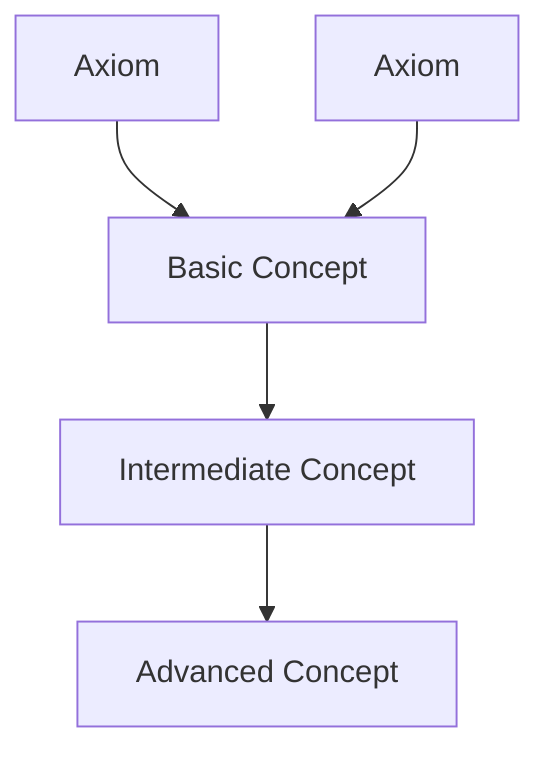

# TopicMastery Workflow

Execute the comprehensive topic learning pipeline: Research(extensive) → Fabric → FirstPrinciples → Council → BeCreative

**Pipeline:** `topic_mastery` from `Data/Pipelines.yaml`

---

## Voice Notification

**MANDATORY - Execute immediately:**

```bash
curl -s -X POST http://localhost:8888/notify \
  -H "Content-Type: application/json" \
  -d '{"message": "Running the TopicMastery workflow in the WisdomSynthesis skill to build comprehensive understanding"}' \
  > /dev/null 2>&1 &
```

**Text notification:**
```
Running the **TopicMastery** workflow in the **WisdomSynthesis** skill to build comprehensive understanding...
```

---

## Workflow Steps

### Step 0: Identify the Topic

Extract the topic to master from the user's request:

| User Says | Topic |
|-----------|-------|
| "master [X]" | X |
| "comprehensive understanding of [X]" | X |
| "deep learning on [X]" | X |
| "topic mastery: [X]" | X |

### Step 1: Extensive Research Phase

Launch comprehensive research using 12 parallel agents (Research extensive mode):

```typescript
// Launch 3x parallel research agents for maximum coverage
Task({
  subagent_type: "ClaudeResearcher",
  description: "Research comprehensive background (1/3)",
  prompt: `Research this topic comprehensively: [TOPIC]

  Focus area: Fundamentals and core concepts
  - What are the basic building blocks?
  - Key terminology and definitions
  - Historical development and evolution
  - Foundational papers and resources

  Return comprehensive findings with sources.`,
  model: "sonnet"
})

Task({
  subagent_type: "GeminiResearcher",
  description: "Research advanced concepts (2/3)",
  prompt: `Research this topic comprehensively: [TOPIC]

  Focus area: Advanced concepts and current state
  - State-of-the-art developments
  - Current research frontiers
  - Expert perspectives and debates
  - Practical applications and use cases

  Return comprehensive findings with sources.`,
  model: "sonnet"
})

Task({
  subagent_type: "ClaudeResearcher",
  description: "Research learning resources (3/3)",
  prompt: `Research this topic comprehensively: [TOPIC]

  Focus area: Learning resources and pedagogy
  - Best textbooks and courses
  - Learning paths and prerequisites
  - Common misconceptions and pitfalls
  - Practice problems and projects
  - Community resources and forums

  Return comprehensive findings with sources.`,
  model: "sonnet"
})
```

**Wait for all 3 research agents to complete.** Combine outputs as `comprehensive_research`.

### Step 2: Extract Concepts and Insights

Apply Fabric extract_wisdom to synthesize research findings:

```typescript
Task({
  subagent_type: "general-purpose",
  description: "Extract concepts and mental models",
  prompt: `Using the Fabric extract_wisdom pattern, analyze these research findings:

  [COMPREHENSIVE_RESEARCH]

  Focus on extracting:
  - **IDEAS**: Core concepts and mental models
  - **INSIGHTS**: Deep understanding and implications
  - **QUOTES**: Key explanations from experts (with attribution)
  - **HABITS**: Recommended learning practices
  - **FACTS**: Fundamental truths and principles
  - **REFERENCES**: Essential sources for deeper learning
  - **RECOMMENDATIONS**: Next steps for mastery

  Return structured wisdom extraction.`,
  model: "sonnet"
})
```

**Wait for extraction completion.** Store output as `extracted_concepts`.

### Step 3: First Principles Decomposition

Identify the fundamental building blocks:

```typescript
Task({
  subagent_type: "general-purpose",
  description: "Decompose to core principles",
  prompt: `Using first principles thinking, decompose this topic to fundamentals:

  Topic: [TOPIC]

  Extracted Concepts:
  [EXTRACTED_CONCEPTS]

  For each concept, ask "What is this really based on?" until you reach irreducible fundamentals.

  Identify:
  1. **Axioms**: What must be true for this field to exist?
  2. **Building Blocks**: What are the minimal components?
  3. **Dependencies**: What must be understood first?
  4. **Composition Rules**: How do simple things combine?
  5. **Emergence**: What patterns arise from fundamentals?

  Return structured first principles analysis showing the hierarchy from axioms to complex concepts.`,
  model: "opus"  // Use opus for deep reasoning
})
```

**Wait for decomposition completion.** Store output as `core_principles`.

### Step 4: Council Teaching Perspectives

Launch multi-perspective pedagogical debate:

```typescript
Task({
  subagent_type: "general-purpose",
  description: "Council teaching debate",
  prompt: `Invoke the Council skill to debate the best way to teach and master: [TOPIC]

  Context:
  - Core Principles: [CORE_PRINCIPLES]
  - Extracted Concepts: [EXTRACTED_CONCEPTS]
  - Research: [COMPREHENSIVE_RESEARCH]

  Debate topic: "What is the optimal learning path to master this topic?"

  Perspectives:
  - **Beginner Teacher**: Focus on fundamentals, analogies, gentle introduction
  - **Expert Practitioner**: Real-world application, practical skills, project-based
  - **Academic Researcher**: Rigorous theory, mathematical foundations, proofs
  - **Skeptical Learner**: Common pitfalls, what's hard, what's overhyped

  Each perspective should:
  1. Propose a learning sequence
  2. Identify critical milestones
  3. Suggest practice exercises
  4. Warn about common mistakes

  Return synthesized learning strategy incorporating all perspectives.`,
  model: "sonnet"
})
```

**Wait for Council completion.** Store output as `pedagogical_insights`.

### Step 5: Deep Synthesis with BeCreative

Use extended reasoning for final synthesis:

```typescript
Task({
  subagent_type: "general-purpose",
  description: "Deep synthesis and integration",
  prompt: `Invoke the BeCreative skill for deep synthesis of this topic mastery:

  Topic: [TOPIC]

  Inputs:
  - Research: [COMPREHENSIVE_RESEARCH]
  - Extracted Concepts: [EXTRACTED_CONCEPTS]
  - Core Principles: [CORE_PRINCIPLES]
  - Teaching Perspectives: [PEDAGOGICAL_INSIGHTS]

  Using extended reasoning, synthesize:
  1. **The Big Picture**: How does everything fit together?
  2. **Key Insights**: What are the most important realizations?
  3. **Mental Models**: What frameworks make this topic intuitive?
  4. **Learning Path**: Optimal sequence from zero to mastery
  5. **Practice Plan**: Concrete exercises and projects
  6. **Next Frontiers**: What to explore after mastery

  Think deeply about connections, patterns, and the essence of understanding.

  Return comprehensive mastery synthesis.`,
  model: "opus"  // Use opus for maximum depth
})
```

**Wait for synthesis completion.** Store output as `mastery_synthesis`.

### Step 6: Generate Mastery Report

Combine all five layers into comprehensive learning guide:

**Report Structure:**

```markdown
# Topic Mastery Guide: [TOPIC]

## Executive Summary

### Mastery Timeline
- **Beginner → Competent**: [timeframe estimate]
- **Competent → Proficient**: [timeframe estimate]
- **Proficient → Expert**: [timeframe estimate]

### Key Insight (The "Aha!" Moment)
[The single most important realization that makes everything click]

---

## Layer 1: Comprehensive Research

### What Is [TOPIC]?
[Clear, jargon-free explanation]

### Why Learn This?
[Practical applications and value]

### Historical Context
[How the field developed]

### Current State
[Where the field is now]

### Key Resources
[Curated list of best sources]

---

## Layer 2: Concepts and Mental Models

### IDEAS (Core Concepts)
[Novel concepts extracted from research]

### INSIGHTS (Deep Realizations)
[Implications and understanding]

### Mental Models
[Frameworks for intuitive understanding]

### Common Misconceptions
[What beginners get wrong]

---

## Layer 3: First Principles Foundation

### Fundamental Axioms
[What must be true for this field to exist]

### Building Blocks
[Minimal irreducible components]

### Dependency Graph


### Composition Rules
[How simple concepts combine]

### Emergent Patterns
[Higher-order insights from fundamentals]

---

## Layer 4: Teaching Perspectives

### Beginner Path
**Focus:** Gentle introduction, analogies, fundamentals
- Week 1-2: [topics]
- Week 3-4: [topics]
- Practice: [exercises]

### Practitioner Path
**Focus:** Real-world skills, project-based learning
- Projects: [list]
- Skills: [list]
- Portfolio: [artifacts to build]

### Academic Path
**Focus:** Rigorous theory, mathematical foundations
- Prerequisites: [required math/theory]
- Core Papers: [foundational research]
- Problem Sets: [theoretical exercises]

### Pitfall Warnings (Skeptical Learner)
- ⚠️ [Common mistake 1]
- ⚠️ [Common mistake 2]
- ⚠️ [What's overhyped]

---

## Layer 5: Integrated Mastery Synthesis

### The Big Picture
[How everything fits together - the forest view]

### Critical Insights
1. [Most important realization #1]
2. [Most important realization #2]
3. [Most important realization #3]

### Optimal Learning Path

#### Phase 1: Foundation (Weeks 1-4)
**Goal:** Understand the basics and build intuition
1. [Step 1]
2. [Step 2]
3. [Step 3]

**Milestone:** [What you should be able to do]

#### Phase 2: Core Competence (Weeks 5-12)
**Goal:** Develop practical skills
1. [Step 1]
2. [Step 2]
3. [Step 3]

**Milestone:** [What you should be able to do]

#### Phase 3: Advanced Understanding (Weeks 13-24)
**Goal:** Deep comprehension and expertise
1. [Step 1]
2. [Step 2]
3. [Step 3]

**Milestone:** [What you should be able to do]

#### Phase 4: Mastery (Weeks 25+)
**Goal:** Contribute to the field
1. [Step 1]
2. [Step 2]
3. [Step 3]

**Milestone:** [What you should be able to do]

---

## Practice Plan

### Daily Exercises
- [15-30 min daily practice]

### Weekly Projects
- Week 1: [project]
- Week 2: [project]
- Week 3: [project]
- [etc.]

### Monthly Milestones
- Month 1: [achievement]
- Month 2: [achievement]
- Month 3: [achievement]

### Capstone Projects
[Final projects demonstrating mastery]

---

## Assessment and Validation

### Self-Assessment Questions
1. [Question testing understanding]
2. [Question testing application]
3. [Question testing synthesis]

### Mastery Indicators
- ✓ You can explain [concept] to a beginner
- ✓ You can build [practical application]
- ✓ You can identify [subtle patterns]
- ✓ You can critique [existing work]

---

## Next Frontiers

### Adjacent Topics to Explore
- [Related field 1] - Why: [connection]
- [Related field 2] - Why: [connection]
- [Related field 3] - Why: [connection]

### Current Research Frontiers
[Open problems and active areas]

### Contribution Opportunities
[How to give back to the field]

---

## Curated Resources

### Beginner-Friendly
- 📚 Book: [title] by [author]
- 🎥 Course: [title] on [platform]
- 📝 Blog: [URL]

### Intermediate
- 📚 Book: [title] by [author]
- 🎥 Course: [title] on [platform]
- 🛠️ Tool: [name] - [purpose]

### Advanced
- 📄 Paper: [title] ([year])
- 📚 Book: [title] by [author]
- 🏛️ Community: [forum/group]

### Essential Tools
- [Tool 1]: [purpose]
- [Tool 2]: [purpose]
- [Tool 3]: [purpose]

---

## Meta-Analysis

### Research Quality
- **Sources**: [#] distinct high-quality sources
- **Coverage**: [Comprehensive/Good/Adequate]
- **Recency**: [How up-to-date is the research?]

### Confidence Assessment
- Fundamental Concepts: ★★★★★ (Very High)
- Learning Path Validity: ★★★★☆ (High)
- Timeline Estimates: ★★★☆☆ (Medium - varies by individual)

### Limitations of This Analysis
[Known gaps or areas requiring further investigation]

---

## Appendix: Learning Habits

### Daily Practices
- [Habit 1]: [Why it works]
- [Habit 2]: [Why it works]

### Common Pitfalls to Avoid
- 🚫 [Pitfall 1]: [How to avoid]
- 🚫 [Pitfall 2]: [How to avoid]

### Community and Support
- Forums: [list]
- Mentorship: [where to find]
- Study Groups: [how to organize]

---

*Generated by WisdomSynthesis TopicMastery Pipeline v1.0.0*
*Research: 3 parallel agents (extensive mode) | Extraction: Fabric | Decomposition: FirstPrinciples | Teaching: Council | Synthesis: BeCreative*
*Total analysis time: ~60-90 seconds*
```

---

## Error Handling

### Research Phase Issues

**Insufficient research depth:**
```
Research returned limited findings (< 5 quality sources).

Options:
1. Continue with available research (lower confidence)
2. Extend research with additional agents
3. Switch to manual resource curation
```

**Topic too broad:**
```
Topic "[TOPIC]" is very broad (e.g., "programming", "physics").

Recommendation: Narrow scope to specific subdomain:
- "Programming" → "Python data structures"
- "Physics" → "Classical mechanics"
- "AI" → "Transformer architectures"

Continue with broad topic? [Y/N]
```

### Extraction Phase Issues

**Concepts too abstract:**
```
Fabric extraction returned high-level abstractions without concrete examples.

Options:
1. Request concrete examples in follow-up
2. Add Fabric pattern: extract_examples
3. Continue with abstract understanding
```

### Council Phase Issues

**Perspectives too similar:**
```
Council debate showed low perspective diversity (high agreement).

Options:
1. Accept current synthesis
2. Add more contrarian perspective
3. Invoke RedTeam for critical analysis
```

### BeCreative Phase Issues

**Synthesis timeout:**
```
BeCreative synthesis exceeded time budget (> 120s).

Options:
1. Accept partial synthesis
2. Switch to sonnet model (faster, less depth)
3. Extend timeout for complete deep synthesis
```

---

## Performance Notes

**Typical execution time:** 60-90 seconds

**Breakdown:**
- Research (extensive): ~20-30s (3 parallel agents)
- Fabric extraction: ~10-15s
- FirstPrinciples: ~15-20s (opus model)
- Council: ~15-20s
- BeCreative: ~20-30s (opus model)
- Synthesis: <5s

**Model recommendations:**
- Research: `sonnet` (3 parallel agents already)
- Fabric: `sonnet` (pattern following)
- FirstPrinciples: `opus` (deep reasoning required)
- Council: `sonnet` (good debate quality)
- BeCreative: `opus` (maximum synthesis depth)

**Cost vs Quality Tradeoffs:**
- **Budget mode**: All `sonnet`, skip BeCreative → ~45s, Medium quality
- **Standard mode**: As specified → ~60-90s, High quality
- **Maximum mode**: All `opus`, extended BeCreative → ~120s, Maximum quality

---

## Examples

**Example 1: Master a technical topic**
```
User: "I want to master Rust programming"

→ Research: Fundamentals, advanced concepts, learning resources (3 agents)
→ Fabric: Extract core concepts, ownership model, mental models
→ FirstPrinciples: Decompose to memory safety axioms
→ Council: Beginner path (gentle intro), Practitioner (build projects), Academic (type theory), Skeptic (what's hard)
→ BeCreative: Integrate into complete learning path with milestones
→ Output: Comprehensive 6-month mastery guide with projects
```

**Example 2: Learn theoretical topic**
```
User: "Comprehensive understanding of quantum mechanics"

→ Research: Historical development, core principles, modern applications
→ Fabric: Extract key concepts (superposition, entanglement, measurement)
→ FirstPrinciples: Decompose to wave-particle duality, uncertainty principle
→ Council: Beginner (analogies), Practitioner (applications), Academic (math), Skeptic (interpretations)
→ BeCreative: Synthesize coherent understanding from Copenhagen to many-worlds
→ Output: Deep learning guide from basics to frontier research
```

**Example 3: Master a creative skill**
```
User: "Topic mastery: storytelling and narrative structure"

→ Research: Narrative theory, story structures, master writers
→ Fabric: Extract storytelling principles, character archetypes, plot patterns
→ FirstPrinciples: Core elements (conflict, character, change)
→ Council: Beginner (3-act structure), Practitioner (write daily), Academic (literary theory), Skeptic (formula vs creativity)
→ BeCreative: Integrate into practice-focused mastery path
→ Output: Creative learning guide with writing exercises
```

---

## Integration Notes

**Feeds into:**
- Personal learning plans (MEMORY/STATE/learning/)
- Project generation (based on practice plan)
- Further research (adjacent topics)

**Uses extensively:**
- Research skill (extensive mode - 12 agents total)
- Fabric patterns (extract_wisdom)
- FirstPrinciples (deep decomposition)
- Council (multi-perspective debate)
- BeCreative (extended reasoning synthesis)
