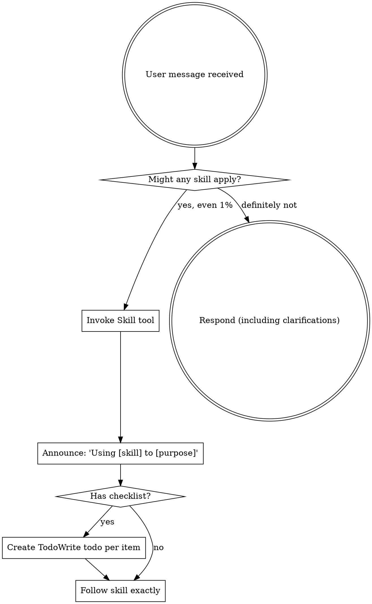

<EXTREMELY-IMPORTANT>
If you think there is even a 1% chance a skill might apply to what you are doing, you ABSOLUTELY MUST invoke the skill.

IF A SKILL APPLIES TO YOUR TASK, YOU DO NOT HAVE A CHOICE. YOU MUST USE IT.

This is not negotiable. This is not optional. You cannot rationalize your way out of this.
</EXTREMELY-IMPORTANT>

## How to Access Skills

**In Claude Code:** Use the `Skill` tool. When you invoke a skill, its content is loaded and presented to you—follow it directly. Never use the Read tool on skill files.

**In other environments:** Check your platform's documentation for how skills are loaded.

# Using Skills

## The Rule

**Invoke relevant or requested skills BEFORE any response or action.** Even a 1% chance a skill might apply means that you should invoke the skill to check. If an invoked skill turns out to be wrong for the situation, you don't need to use it.



## Red Flags

These thoughts mean STOP—you're rationalizing:

| Thought | Reality |
|---------|---------|
| "This is just a simple question" | Questions are tasks. Check for skills. |
| "I need more context first" | Skill check comes BEFORE clarifying questions. |
| "Let me explore the codebase first" | Skills tell you HOW to explore. Check first. |
| "I can check git/files quickly" | Files lack conversation context. Check for skills. |
| "Let me gather information first" | Skills tell you HOW to gather information. |
| "This doesn't need a formal skill" | If a skill exists, use it. |
| "I remember this skill" | Skills evolve. Read current version. |
| "This doesn't count as a task" | Action = task. Check for skills. |
| "The skill is overkill" | Simple things become complex. Use it. |
| "I'll just do this one thing first" | Check BEFORE doing anything. |
| "This feels productive" | Undisciplined action wastes time. Skills prevent this. |
| "I know what that means" | Knowing the concept ≠ using the skill. Invoke it. |

## Skill Priority

When multiple skills could apply, use this order:

1. **Process skills first** (Brainstorming, SystematicDebugging) - these determine HOW to approach the task
2. **Implementation skills second** (frontend-design, mcp-builder) - these guide execution

"Let's build X" → Brainstorming first, then implementation skills.
"Fix this bug" → SystematicDebugging first, then domain-specific skills.

## Skill Types

**Rigid** (TestDrivenDevelopment, SystematicDebugging): Follow exactly. Don't adapt away discipline.

**Flexible** (patterns): Adapt principles to context.

The skill itself tells you which.

## User Instructions

Instructions say WHAT, not HOW. "Add X" or "Fix Y" doesn't mean skip workflows.

## Available Skills

The skill system maintains a searchable index at `skills/skill-index.json`. Skills are organized by:

- **always** tier: Loaded at session start (e.g., CORE)
- **deferred** tier: Loaded on-demand based on triggers
- **internal** tier: Called by other skills, not directly triggered

## Key Workflow Skills

| Skill | When to Use |
|-------|-------------|
| **Brainstorming** | New features, design exploration |
| **WritingPlans** | After requirements are clear, create implementation plan |
| **ExecutingPlans** | Execute plans in separate session |
| **SubagentDrivenDevelopment** | Execute plans with subagents in current session |
| **FinishingBranch** | Complete work, prepare for merge |
| **SystematicDebugging** | Any bug, test failure, unexpected behavior |
| **TestDrivenDevelopment** | Writing any production code |
| **RequestingCodeReview** | After completing implementation |

## Workflow Routing

| Workflow | Trigger | Description |
|----------|---------|-------------|
| N/A | Auto-loaded at session start | Meta skill - provides guidance on skill usage |

## Examples

**Example 1: Task matching skill**
```
User: "Fix this failing test"
-> Checks: Does SystematicDebugging apply? Yes (1%+ chance)
-> Invokes SystematicDebugging skill
-> Follows RootCauseAnalysis workflow
```

**Example 2: Feature request**
```
User: "Add a dark mode toggle"
-> Checks: Does Brainstorming apply? Yes (new feature)
-> Invokes Brainstorming skill first
-> Then WritingPlans after design approved
```

## Related Skills

- **All Skills** - UsingSkills is the meta-skill that governs when to invoke others
- **Brainstorming** - Primary entry point for new feature work
- **SystematicDebugging** - Primary entry point for debugging
